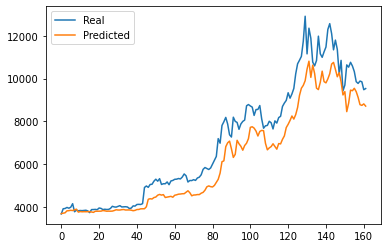
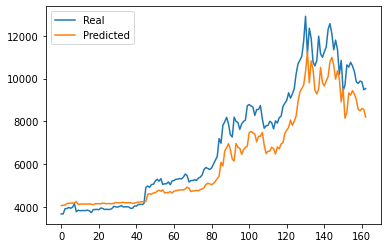
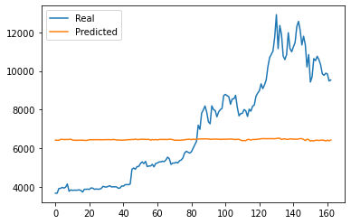
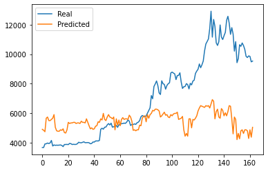
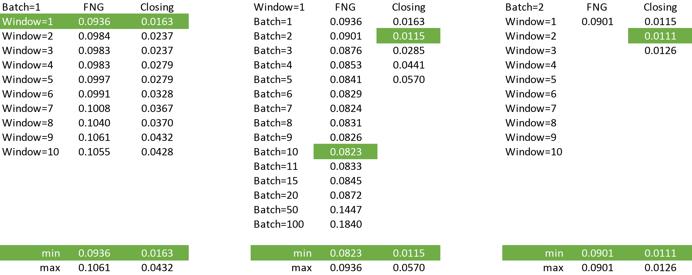

# LSTM Stock Predictor

Use deep learning recurrent neural networks to model bitcoin closing prices. One model uses the Crypto Fear and Greed Index (FNG) to predict the closing price while the other model uses a window of closing prices to predict the nth closing price.

##### Please reference the "lstm_stock_predictor_fng_1_10.ipynb" and "lstm_stock_predictor_closing_2_2.ipynb" notebooks. 

---

#### Preparing the data for training and testing

We: 

1. Used the starter code as a guide to create a Jupyter Notebook for each RNN.
2. For the FNG model, we used the FNG values to try and predict the closing price using a function provided in the notebook to help with this.
3. For the closing prcie model, we used previous closing prcies to try and predict the next closing price using the provided function.
4. Used 70% of the data for training and 30% of the data for testing.
5. Applied a MinMaxScaler to the X and y values to scale the data for the model.
6. Reshaped the X_train and X_test values to fit the model's requirement of samples, time steps, and features.

---

#### Building and training custom LSTM RNNs

We: 

1. Created the same custom LSTM RNN architecture in each Jupyter Notebook, using the FNG values to fit the data in one notebook whileusing the closing prices to fit the data in the other notebook.
2. Used the same parameters and training steps for each model to accurately compare the models.
3. Performed a series of iterations with different window and batch sizes to determine the optimal values for each model, both visually and numerically to minimize the loss amount.

---

#### Evaluating the performance of each model

* Which model has a lower loss? 
>
>The Closing model had the lower loss for all window and batch sizes analyzed.

* Which model tracks the actual values better over time?
>
>The Closing model tracked the actual values better over time (based on visual inspection of the plots as well as the amount of loss).

* Which window size works best for the model?
>
>For the Closing model, we found the optimal parameters were a window of 2 and a batch size of 2. With these settings, loss was minimized at a value of 0.0111. It should be noted that VISUALLY, a window of 1 and batch size of 2 seems to provide a closer fit with less smoothing, however, the loss with these parameters is slightly higher at 0.0115.
>
>For the inferior FNG model, we found the optimal parameters were a window of 1 and a batch size of 10. With these settings, loss was minimized at a value of 0.0823, however, visually the Predicted values approach a flat line as the batch size is increased.

#### Optimal Closing Model Output (Window=2, Batch=2, Loss=0.0111):

#### Slightly Less Optimal Closing Model Output (Window=1, Batch=2, Loss=0.0115):

#### Optimal FNG Model Output (Window=1, Batch=10, Loss=0.0823):

#### Visually Improved FNG Model Output (Window = 1, Batch = 1, Loss=0.0936):

---

While the optimal plots are displayed in this document, please feel free to view the other iterations with various parameter values in the "Iterations" directory.

#### Loss Values for a Variety of Window and Batch Sizes:
